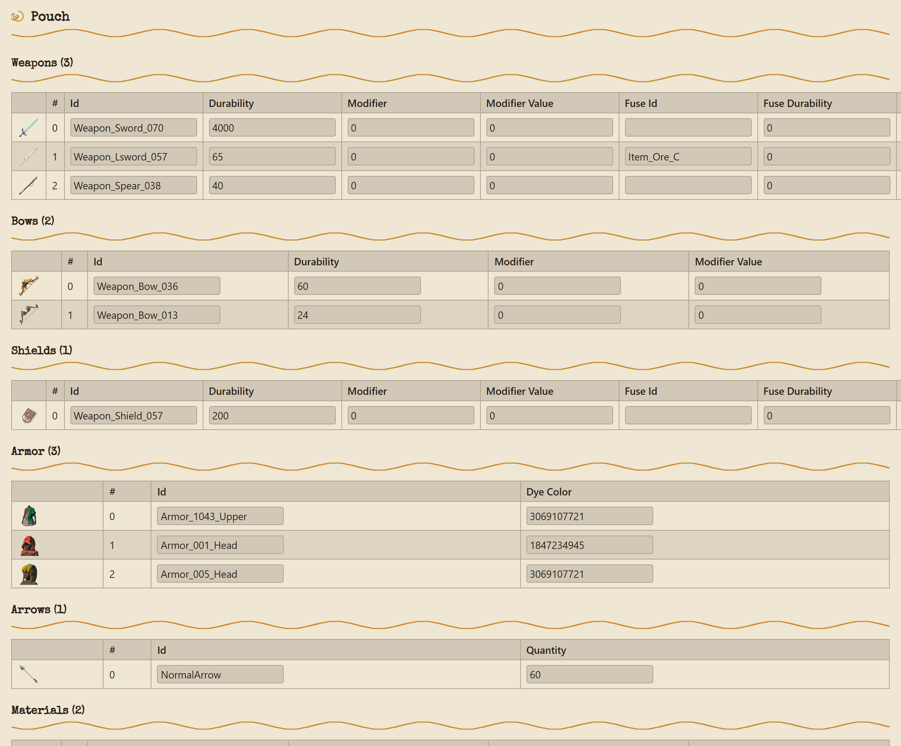

# Zelda AIO Save Editor

A unified save editor for *The Legend of Zelda: Breath of the Wild* and *Tears of the Kingdom*,
built as a Rust save-parsing core with a Tauri desktop shell.

> **Status: early development.** The save-format engine and IPC wiring are functional and tested
> against real save files, and a themed editor UI covers most of what the backend exposes for
> both games. See [Status & roadmap](#status--roadmap) below for what's still missing.



## Features

### Breath of the Wild
- Player stats (hearts, stamina, rupees, mon, playtime), positions, and current map
- Full inventory: weapons, bows, shields, armor, materials, food, and key items, with automatic
  item categorization and item icons (including dye-colored armor)
- Weapon/bow/shield modifier slots
- Horses (name, saddle, reins, type)
- Completionism mass-unlock: koroks, defeated hinox/talus/molduga, visited locations

### Tears of the Kingdom
- Player stats, save position, and current checkpoint
- Full pouch inventory: weapons, bows, shields, armor, arrows, materials, key items, Zonai
  devices, and food (including fused-weapon and recipe data), with item icons
- Horses, including bond, stats, and coat/mane/eye coloring
- Completionism counts: shrines, koroks, defeated bosses, visited locations (read-only, matching
  the absence of a mass-unlock feature for these categories in-game), plus mass-unlock for
  bubbuls, sage wills, and Addison sidequest markers
- AutoBuild: all 30 saved Ultrahand schematics, including camera framing and favorite status
- Map pins, markers, and teleporters
- `caption.sav` preview: the save-slot thumbnail and date/autosave metadata
- Advanced hash browser: every field in a save's hash table, searchable by name or hash, with
  direct editing for the fields it's safe to edit generically

### Both games
- Every save is backed up to a `.bak` file before it's overwritten

## Project layout

```
crates/save-engine/  headless Rust library: binary parsing, hash-table resolution, and typed
                      read/write accessors for both games' save formats. No UI dependencies.
src-tauri/            Tauri v2 backend: converts save-engine's types to serializable DTOs and
                      exposes them as IPC commands, plus native file open/save dialogs.
src/                  React + TypeScript frontend (Vite), with a byronic-inspired visual
                      design system.
```

Everything under `crates/save-engine` builds and tests independently of Tauri, so the parsing
logic can be reused (or audited) without pulling in a desktop toolchain.

## Getting started

**Prerequisites:** a recent [Rust toolchain](https://rustup.rs/), [Node.js](https://nodejs.org/)
18+, and the [Tauri v2 prerequisites](https://v2.tauri.app/start/prerequisites/) for your
platform.

```bash
npm install

# Run the engine's own test suite (no Tauri/Node required)
cargo test -p save-engine

# Run the desktop shell's IPC layer tests
cargo test -p zelda-save-shell

# Launch the desktop app in development mode
npm run tauri dev
```

Target platforms are Windows, Linux, and Android.

Once the app is running, click **Open...** and pick a save file: `game_data.sav` for BOTW,
`progress.sav` for TOTK, or `caption.sav` for a save-slot thumbnail preview. **Save** writes back
to the same file (after backing up the previous contents to a `.bak` file alongside it);
**Save As...** picks a new location.

## Status & roadmap

The save-format core is complete for both games' most commonly edited data (see Features above),
and every shipped engine capability is wired through to the Tauri IPC layer with a typed
command per read/write operation, backed by a themed UI. What's still ahead:

- A BOTW equivalent of the advanced hash browser (BOTW's hash dictionary isn't vendored yet)
- An interactive in-game map, on hold pending a licensing check on the map imagery
- Responsive layout across desktop and mobile form factors
- Packaging and release automation (installers, Android APK/AAB, CI)

## Credits

The BOTW and TOTK save formats implemented here (hash tables, field offsets, and encoding
details) were taken from [marcrobledo/savegame-editors][source-repo] (MIT licensed). This
project is an independent Rust reimplementation built on top of that research, not a fork of
its code. The item icons under `public/icons/` are also vendored from that repository, which in
turn credits [spriters-resource.com][spriters-resource] for the BOTW sprite sheets.

[source-repo]: https://github.com/marcrobledo/savegame-editors
[spriters-resource]: https://www.spriters-resource.com/wii_u/thelegendofzeldabreathofthewild/

## Disclaimer

This project is not affiliated with or endorsed by Nintendo. It edits save files for personal
and educational use; always keep a backup of your save data before editing it.

## License

MIT. See [LICENSE](LICENSE).
