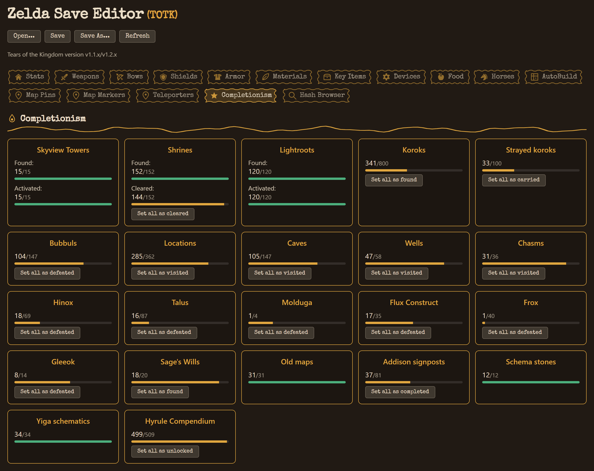
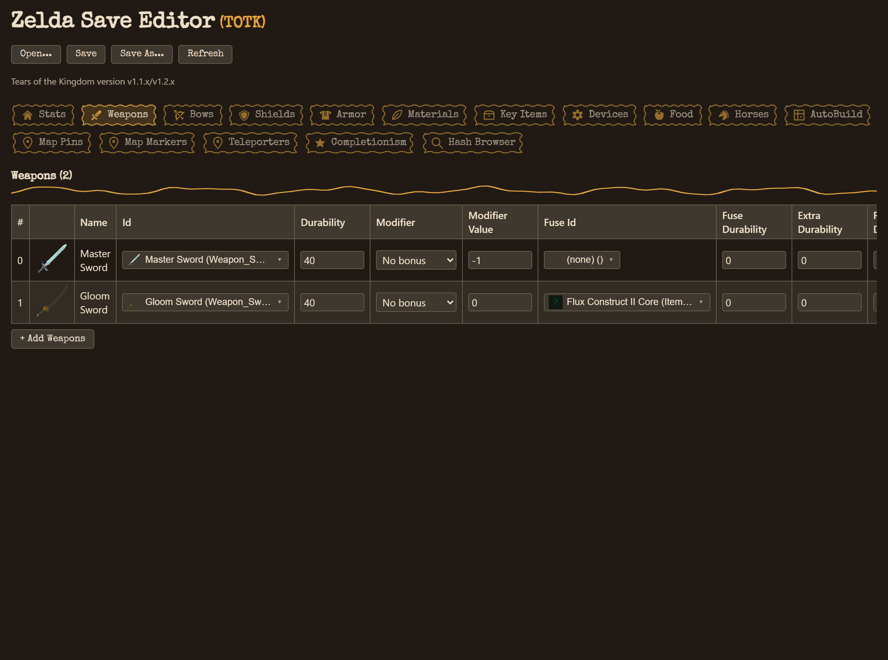
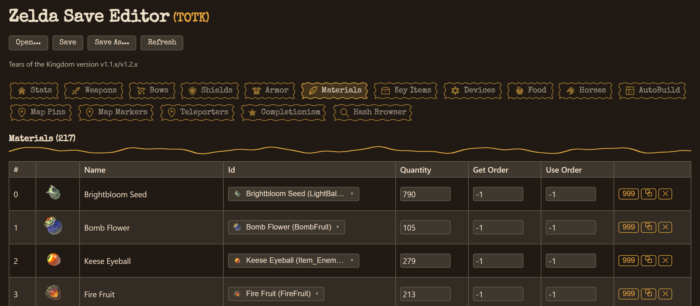

<div align="center">

# Zelda AIO Save Editor

A single save editor for **The Legend of Zelda: Breath of the Wild** and **Tears of the Kingdom**,
built on a tested Rust save-parsing core with a themed Tauri desktop shell.




</div>

Open a save, edit almost anything the games track, and write it back. Each game gets its own theme
(BOTW blue, TOTK gold), the same card-and-table layout, and a full completionism panel. Every save is
backed up before it's overwritten.

> **Status:** the save-format engine and the IPC layer are complete and tested against real save
> files, and the UI covers both games' commonly edited data. A few advanced extras are still in
> progress, listed under [Status & roadmap](#status--roadmap).

## Features

### Both games

- **Inventory tables** with item icons, English names next to each raw id, and a searchable
  icon-and-name picker in place of blind id fields
- **Per-item actions** on every row: delete, duplicate, and one-click fills (restore durability,
  set a stack to its max)
- **Completionism panel**: a card per category with a current/total count, a progress bar, and a
  "set all" button that completes it in one click
- **Detected game version** shown under the toolbar, with a modded-save flag
- **Responsive layout**: wide tables at desktop widths, collapsing to tap-friendly cards on narrow
  windows, with no horizontal scrollbar
- A `.bak` backup is written before any save is overwritten

### Breath of the Wild

- Player stats (hearts, stamina, rupees, mon, playtime), positions, and current map
- Full inventory: weapons, bows, shields, armor, materials, food, and key items, with automatic
  categorization and dye-colored armor icons
- Weapon, bow, and shield modifier slots
- Horses (name, saddle, reins, type)
- Completionism: koroks, defeated hinox/talus/molduga, and visited locations (completing koroks
  also updates the seed counter and adds Korok Nuts, the way the game does)

### Tears of the Kingdom

- Player stats, save position, and current checkpoint
- Full pouch: weapons, bows, shields, armor, arrows, materials, key items, Zonai devices, and food,
  including fused-weapon and recipe data
- Key abilities (Ultrahand, Fuse, Ascend, Recall, Autobuild, Amiibo) as toggles
- Horses, including bond, stats, and coat/mane/eye coloring
- Completionism across every tracked category: skyview towers, shrines, lightroots, koroks, strayed
  koroks, bubbuls, locations, caves, wells, chasms, hinox, talus, molduga, flux constructs, frox,
  gleeoks, sage's wills, old maps, Addison signposts, schema stones, Yiga schematics, and the Hyrule
  Compendium
- AutoBuild: all 30 saved Ultrahand schematics, with camera framing and favorite status
- Map pins, markers, and teleporters
- `caption.sav` preview: the save-slot thumbnail and date/autosave metadata
- Advanced hash browser: every field in a save's hash table, searchable by name or hash, with direct
  editing where it's safe to edit generically

## Screenshots

<table>
<tr>
<td width="50%">

<p align="center"><em>Pouch tables with icons, name pickers, and fuse data</em></p>
</td>
</tr>
<tr>
<td width="50%">

<p align="center"><em>Per-item actions and quick-fills on every row</em></p>
</td>
</tr>
</table>

## Project layout

```
crates/save-engine/  Headless Rust library: binary parsing, hash-table resolution, and typed
                     read/write accessors for both games' save formats. No UI dependencies.
src-tauri/           Tauri v2 backend: converts the engine's types to serializable DTOs and exposes
                     them as IPC commands, plus native file open/save dialogs.
src/                 React + TypeScript frontend (Vite) with a per-game visual theme.
```

Everything under `crates/save-engine` builds and tests independently of Tauri, so the parsing logic
can be reused, or audited, without a desktop toolchain.

## Getting started

**Prerequisites:** a recent [Rust toolchain](https://rustup.rs/), [Node.js](https://nodejs.org/) 18+,
and the [Tauri v2 prerequisites](https://v2.tauri.app/start/prerequisites/) for your platform.

```bash
npm install

# Run the engine's own test suite (no Tauri or Node required)
cargo test -p save-engine

# Run the desktop shell's IPC layer tests
cargo test -p zelda-save-shell

# Launch the desktop app in development mode
npm run tauri dev
```

Once the app is running, click **Open...** and pick a save file: `game_data.sav` for BOTW,
`progress.sav` for TOTK, or `caption.sav` for a save-slot thumbnail preview. **Save** writes back to
the same file after backing up the previous contents to a `.bak` alongside it; **Save As...** picks a
new location.

## Status & roadmap

The save-format core is complete for both games' commonly edited data, every engine capability is
wired through the IPC layer with a typed command per read/write, and the UI is responsive and themed.
Desktop release builds for Windows, Linux, and macOS are automated. Still ahead:

- A BOTW equivalent of the advanced hash browser (BOTW's hash dictionary isn't vendored yet)
- An interactive in-game map, on hold pending a licensing check on the map imagery
- An Android build (the responsive layout already suits it; needs project init and a signing key)
- Optional completionism extras: a pin-to-map mode and the item rewards the games hand out when you
  complete a category, on top of the flag/GUID flips the panel does today

## Credits

The BOTW and TOTK save formats implemented here (hash tables, field offsets, and encoding details)
were taken from [marcrobledo/savegame-editors][source-repo] (MIT licensed). This project is an
independent Rust reimplementation built on that research, not a fork of its code. The item icons under
`public/icons/` are also vendored from that repository, which in turn credits
[spriters-resource.com][spriters-resource] for the BOTW sprite sheets.

[source-repo]: https://github.com/marcrobledo/savegame-editors
[spriters-resource]: https://www.spriters-resource.com/wii_u/thelegendofzeldabreathofthewild/

## Disclaimer

This project is not affiliated with or endorsed by Nintendo. It edits save files for personal and
educational use. Always keep a backup of your save data before editing it.

## License

MIT. See [LICENSE](LICENSE).
